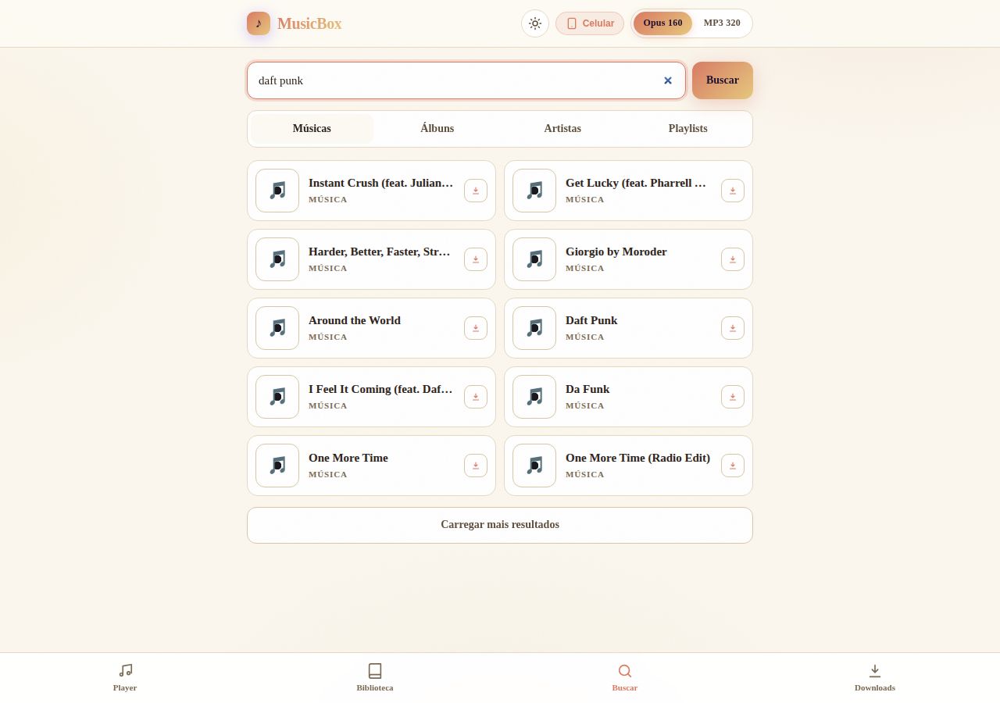

# MusicBox — Player de Música & Downloader Pessoal

MusicBox é um **Player de Música e Downloader Pessoal (Self-Hosted)** que busca, reproduz e baixa músicas e álbuns do YouTube Music para ouvir offline no celular e no computador.



## Funcionalidades

### Temas — claro "Polido" e escuro "Analog"

- O tema claro **"Polido"** (creme/terracota/âmbar, serifada Georgia) é o **padrão na primeira visita**; o toggle no header (☀/🌙) alterna para o tema escuro **"Analog"** (marrom quente/terracota).
- A preferência fica em `localStorage` (`musicbox.theme`) e vale para as próximas sessões.

### Busca

- **Status dinâmico por seção**: a UI mostra "Músicas encontradas — buscando álbuns, artistas e playlists…" e entrega cada seção conforme resolve (SSE) — sem esperar a busca inteira.
- **Otimizada com cache**: títulos resolvidos por URL ficam em cache por **7 dias**; resultados de busca por **10 minutos** (memória + disco em SQLite).
- **4 workers** resolvem títulos em paralelo.
- A **1ª busca de uma query nova leva ~1–2 min** (rate-limit do YouTube); buscas repetidas são instantâneas.

### Download

- Formato padrão **Opus 160** (antes MP3 320) — config `DEFAULT_FORMAT=opus`.
- Botões com **3 estados**: idle → spinner + % → "Baixado".
- CTA **"Baixar Álbum · N faixas"** em álbuns e playlists.
- **Download anônimo por design**: sem cookies — sessão logada é flagada pelo YouTube (seção dedicada abaixo).

### Downloads resilientes

- Falha de rede → **até 3 tentativas automáticas** com backoff **5s → 30s → 2min**.
- **Fila persistida em SQLite**: restart do servidor retoma os downloads **no ponto exato** (arquivos `.part`).
- Banner **"Você está offline"** no frontend + **auto-retry** ao reconectar; badge **"Reconectando · tentativa N/3"**.
- Pausar/retomar downloads **em lote** ou por tarefa.

### Player rico

- Vinil girando a **33⅓ rpm** com agulha (tonearm) que levanta/abaixa ao tocar/pausar.
- **Bottom-sheet**: arrastar para baixo minimiza o player **sem parar a música**.
- **Media Session**: notificação rica com seekbar na tela de bloqueio.
- **Crossfade ajustável 1–12s** (slider no player, `localStorage` `musicbox.crossfade`); **0 = gapless** com pré-load da próxima faixa.

### Biblioteca

- Segmentos **Histórico | Artistas | Álbuns | Local** + filtros de formato (**Todos/MP3/Opus**).
- Agrupamento por artista/álbum com **contagem de faixas**.
- **Swipe**: esquerda adiciona à fila, direita baixa.

### Biblioteca local (arquivos do dispositivo)

- Selecione uma pasta do dispositivo (`showDirectoryPicker` no desktop; `webkitdirectory` no Android/web).
- Os arquivos **não saem do dispositivo**; metadados ficam parcialmente persistidos via **IndexedDB**.
- Em sessão nova, é preciso re-selecionar a pasta para tocar (limitação documentada abaixo).

### Letras sincronizadas (LRC)

- Baixadas automaticamente da **LRCLIB** junto com o download (arquivo `.lrc` ao lado do áudio).
- Aba **"Letras"** no player com **karaokê** (linha ativa + auto-scroll) — funciona offline.

### Armazenamento

- Aba Downloads com **3 visões**: disco do servidor, tamanho da biblioteca e quota do dispositivo/cache.
- Botões **"Limpar órfãos (.part)"** e **"Limpar cache"**; alerta de **disco baixo**.

### Acessibilidade e robustez

- Cards **clicáveis por teclado** (Enter/Espaço) e contraste **AA**.
- **Fontes self-hosted** (offline-first); service worker com **eviction de cache de áudio** (máx ~500 MB ou 80% da quota).

### Playlists e integrações

- **Playlists do usuário**: crie, adicione a faixa tocando no player e exporte `.m3u` (persistência SQLite).
- **Busca por URL direta** (YouTube / YouTube Music — inclusive `list=PL...`) e **playlists do YouTube Music** (faixas numeradas por posição).
- **Edição de metadados / tags ID3**: edite título, artista e álbum na interface e nas tags do arquivo.
- **Notificações de download**, **capas em HD**, cancelamento de downloads, re-enfileiramento de falhas em 1 clique e **token de acesso opcional** (`MUSICBOX_TOKEN`).

## Stack

- **Python 3.11+** (testado com 3.12)
- **FastAPI** — servidor HTTP, rotas REST e WebSocket
- **yt-dlp** — extração de metadados e download
- **mutagen** — incorporação e edição de tags de áudio (ID3/Ogg)
- **SQLite** — histórico, playlists, fila de downloads e caches (via stdlib `sqlite3`, zero-config)
- **LRCLIB** — letras sincronizadas (LRC) baixadas automaticamente
- **Frontend Vanilla & PWA** (HTML5, ServiceWorker, Media Session, temas claro/escuro, Audio Engine) em `app/static/`
- **Sem Docker** — o backend roda nativo

## Requisitos

- Python 3.11+
- `ffmpeg` — necessário para a conversão para mp3/opus e o embed da capa (cheque com `ffmpeg -version`)
- `mutagen` — dependência Python do `yt-dlp` para pós-processamento de capas de áudio
- `pip`

## Instalação

```bash
python3 -m venv .venv
.venv/bin/pip install -r requirements.txt
```

Para desenvolvimento (adiciona `pytest`, `httpx`, `pytest-cov` e `ruff` aos deps de produção):

```bash
.venv/bin/pip install -r requirements-dev.txt
```

Ou use o Makefile: `make install` (produção) e `make install-dev` (desenvolvimento). O `install-dev` só reinstala quando `requirements-dev.txt` mudar.

## Uso

```bash
make dev
```

O `make dev` cria o venv se ausente, instala as dependências e avisa se o `ffmpeg` faltar (continua mesmo assim). O servidor sobe em `http://0.0.0.0:8080` e imprime o IP local no startup — acesse pelo celular na mesma rede para baixar músicas.

> **Acesso pelo Celular / Firewall:** Se o celular não conseguir conectar, libere a porta 8080 no firewall do Linux executando: `sudo ufw allow 8080/tcp`.

```bash
make test
```

Roda a suíte pytest (163 testes, com yt-dlp mockado — sem rede).

## Configuração

Opcional: copie `.env.example` para `.env` e ajuste conforme necessário.

```bash
cp .env.example .env
```

| Chave | Padrão | Descrição |
|---|---|---|
| `PORT` | `8080` | Porta do servidor HTTP (FastAPI/Uvicorn) |
| `MUSICBOX_DIR` | `~/Music/musicbox/` | Diretório onde as músicas baixadas são salvas |
| `DEFAULT_FORMAT` | `opus` | Formato padrão de download: `mp3` ou `opus` (o padrão mudou de MP3 320 para Opus 160) |
| `WORKERS` | `2` | Número de downloads simultâneos |
| `SOCKET_TIMEOUT` | `30` | Timeout de socket (segundos) nas requisições de rede |
| `RETRIES` | `2` | Número de tentativas de download antes de considerar falha |
| `MUSICBOX_TOKEN` | (não definido) | Token de acesso compartilhado exigido nas rotas `/api/*` (header `X-MusicBox-Token` ou query `?token=`). Sem ele, a API fica aberta na rede local |
| `ALLOWED_ORIGINS` | (vazio) | Allowlist (separada por vírgula) de origins liberadas no guard de CSRF/drive-by dos métodos de escrita (POST/PUT/PATCH/DELETE). Vazio = só o host da própria request |

Precedência: **variável de ambiente > `.env` > padrão**. Em `MUSICBOX_DIR`, `~` e `$VAR` são expandidos.

## Download anônimo (Sign in to confirm you're not a bot)

A sessão logada do YouTube está **flagada**: o player response vem sem `streamingData`, então o yt-dlp falha com `Requested format is not available` (e variações do `Sign in to confirm you're not a bot`).

A solução aplicada foi o **download anônimo com `player_client=android`** (`app/downloader.py::_default_executor`, `extractor_args={"youtube": {"player_client": ["android"]}}`): o YouTube devolve o formato **18 (mp4, ~44k de áudio mp4a.40.2)**, convertido para mp3/opus via FFmpeg. O app **não usa cookies no download de propósito** — a sessão logada está flagada, e tentar usá-la faz o download falhar. Por isso não há configuração de cookies (`COOKIES_FILE`/`COOKIES_FROM_BROWSER` foram removidas).

### Qualidade do áudio

Com a abordagem anônima + client `android`, o áudio vem do formato **18 (mp4, ~44k)** e é convertido para mp3/opus via FFmpeg — qualidade **funcional, porém inferior** à de uma sessão logada saudável. Se no futuro o YouTube voltar a liberar formatos melhores para sessão logada, a estratégia de download pode ser revisada.

## Como funciona

Adaptado ao yt-dlp **2026.07.04**: o extrator atual não tem mais `ytmsearch:` nem fornece `track_number`/ano para álbuns. O cliente (`app/ytdlp_client.py`) contorna isso:

- **Busca** via URL `https://music.youtube.com/search?q=...` com `extract_flat=True`, separando as seções de músicas, álbuns, artistas e playlists (parâmetro `sp`). Resultados ficam em **cache LRU em memória + SQLite em disco** (`search_cache.db` em `MUSICBOX_DIR`), TTL 600s (10 min); títulos resolvidos por URL têm **cache próprio de 7 dias**; **4 workers** resolvem títulos em paralelo.
- **Latência de busca**: a 1ª busca de uma query nova leva **~1–2 min** por causa do rate-limit do YouTube (resolução em paralelo + cache evitam re-resolves); buscas repetidas respondem instantaneamente.
- **URLs diretas**: `watch?v=`/`youtu.be` viram música avulsa; `list=PL...`/`VL...`/`OLAK...` viram um item de playlist que abre a lista de faixas.
- **Álbum/Playlist**: o id `MPRE...` (browse) resolve por redirect para a playlist `OLAK...`; playlists `PL`/`VL`/mixes resolvem direto pela URL de playlist; as faixas são numeradas por **posição** (1..N) e não há ano na UI (`year=None`).
- **Artista**: não há página de álbuns de artista no yt-dlp — a tela de artista usa a **busca filtrada a álbuns**.
- **Download**: yt-dlp `-x` com `FFmpegExtractAudio` (mp3/opus) + `EmbedThumbnail`; o arquivo final fica em `MUSICBOX_DIR/<artista>/<álbum>/<NN> - <título>.<ext>` (NN = posição da faixa, zero-padded). A letra (`.lrc`) é buscada na LRCLIB e gravada ao lado do áudio; falha de rede dispara retry automático (3 tentativas, backoff 5s/30s/2min) e a fila é persistida no SQLite.

## API

| Método | Caminho | Descrição | Erros |
|---|---|---|---|
| `GET` | `/` | Serve o `index.html` do frontend (200) | 503 (fallback quando `index.html` está ausente) |
| `GET` | `/api/config` | Config leve para a UI (`has_ffmpeg`, `local_ip`, `server_url`, `auth_required`) — pública de propósito | — |
| `GET` | `/api/search?q=&limit=` | Busca músicas, artistas, álbuns e playlists no YouTube Music (`limit`: 1–40 itens por seção, padrão 10) | 404, 422, 502, 503 |
| `GET` | `/api/search/stream?q=` | SSE da busca: eventos `section`/`done`/`error` conforme cada seção resolve | 422 |
| `GET` | `/api/browse` | Biblioteca navegável: artistas → álbuns → faixas (baixadas) | — |
| `GET` | `/api/playlists` | Lista playlists do usuário (com contagem de faixas) | — |
| `POST` | `/api/playlists` | Cria playlist (`{name}`) → 201 | 422 |
| `DELETE` | `/api/playlists/{id}` | Apaga playlist (faixas em cascata) | 404 |
| `GET` | `/api/playlists/{id}` | Playlist com faixas (metadados do histórico) | 404 |
| `POST` | `/api/playlists/{id}/tracks` | Adiciona faixa (`{yt_id}`), dedupe por yt_id → 201 | 404, 422 |
| `DELETE` | `/api/playlists/{id}/tracks/{yt_id}` | Remove faixa da playlist | 404 |
| `GET` | `/api/playlists/{id}/export.m3u` | Exporta a playlist como `.m3u` (URLs do `/api/library`) | 404 |
| `GET` | `/api/artists/{artist_name}/albums` | Álbuns de um artista (pelo nome) | 404, 502, 503 |
| `GET` | `/api/albums/{browse_id}/tracks` | Faixas de um álbum pelo browse_id | 404, 502, 503 |
| `POST` | `/api/downloads` | Enfileira um download (`yt_id`, `album_id` ou `playlist_id`, `formato: mp3\|opus`) → 202 | 404, 422, 502, 503 |
| `GET` | `/api/downloads` | Snapshot das tasks em memória (status/progresso/stage) | — |
| `DELETE` | `/api/downloads/{task_id}` | Cancela uma tarefa (pendente ou em execução) | 404 |
| `POST` | `/api/downloads/pause` | Pausa downloads em lote (`task_ids` opcional; ausente = todos os ativos) | — |
| `POST` | `/api/downloads/resume` | Retoma downloads pausados em lote | — |
| `POST` | `/api/downloads/{task_id}/pause` | Pausa uma tarefa ativa | 404, 409 |
| `POST` | `/api/downloads/{task_id}/resume` | Retoma uma tarefa pausada | 404, 409 |
| `POST` | `/api/downloads/retry-failed` | Re-enfileira todas as faixas `failed` do histórico | — |
| `GET` | `/api/storage` | Estatísticas de armazenamento (disco + biblioteca + `.part`) | — |
| `POST` | `/api/storage/cleanup` | Remove `.part`/`.ytdl` órfãos; reporta `removed`/`freed_bytes` | — |
| `GET` | `/api/history` | Histórico persistido de downloads | — |
| `POST` | `/api/history/{yt_id}/metadata` | Atualiza título/artista/álbum no banco E nas tags do arquivo | 404, 422 |
| `DELETE` | `/api/history/{yt_id}` | Remove o registro, o arquivo de mídia e a letra `.lrc` irmã do servidor | 404 |
| `GET` | `/api/library/{rel_path:path}` | Serve um arquivo baixado (com proteção contra path traversal) | 404 |
| `GET` | `/api/library/{yt_id}/lyrics` | Serve a letra `.lrc` baixada junto com a faixa (texto) | 404 |

> **Autenticação:** com `MUSICBOX_TOKEN` definido, TODAS as rotas `/api/*` (exceto `/api/config`) exigem o token via header `X-MusicBox-Token` ou query `?token=` (necessário para `<audio>`/downloads). O `/ws` exige o token na query.

> **Origins:** métodos de escrita (POST/PUT/PATCH/DELETE) passam por um guard de origin — a request precisa ter o mesmo host ou estar na allowlist `ALLOWED_ORIGINS` (proteção contra CSRF/drive-by; requisições sem header `Origin`, como curl/scripts, seguem livres — quem precisar de proteção de verdade usa o token).

## WebSocket `/ws`

Ao conectar, recebe um snapshot do estado atual e depois updates de progresso:

```json
{"type": "snapshot", "tasks": [...]}
{"type": "update", "task_id": "...", "status": "running", "progress": 42.5, "stage": "extracting"}
```

## Estrutura

```
app/
  main.py           # rotas REST, WebSocket /ws, static e startup
  config.py         # Settings + parser de .env (env > .env > padrão)
  models.py         # Track, Album, SearchItem, SearchResults, DownloadTask
  ytdlp_client.py   # cliente do YouTube Music via yt-dlp (busca/álbum/metadados)
  downloader.py     # fila FIFO + thread pool, progresso, retry de rede, fila persistida
  history.py        # histórico em SQLite (dedupe por yt_id, metadados/tags)
  playlists.py      # playlists do usuário em SQLite
  lyrics.py         # busca de letras sincronizadas (LRC) na LRCLIB
  static/           # frontend vanilla (temas, player, biblioteca, PWA)
tests/              # suíte pytest (yt-dlp mockado, sem rede)
```

## Testes

```bash
make test
```

163 testes, distribuídos por módulo: `config` 10 · `downloader` 32 · `history` 14 · `lyrics` 7 · `main` 66 · `playlists` 10 · `ytdlp_client` 24.

## Limitações

- **Widget de tela inicial não suportado**: o PWA não tem API de widget nativa — no Android seria necessário um app nativo/TWA, e o iPhone não suporta widgets de PWA.
- **Biblioteca local exige re-seleção da pasta** em sessão nova (o app não lê tags ID3 dos arquivos do dispositivo — só os metadados persistidos no IndexedDB).
- **A 1ª busca de uma query nova demora ~1–2 min** (rate-limit do YouTube — ver "Busca" acima); buscas repetidas respondem instantaneamente.
- **ffmpeg é obrigatório para TODOS os downloads — mp3 E opus**: a conversão passa por
  `FFmpegExtractAudio` nos dois formatos (opus não é "nativo"). Sem ffmpeg no servidor os
  downloads falham; a UI exibe um banner persistente e desabilita os botões de download.
- Não há CORS (o frontend é servido pelo próprio FastAPI, mesmo domínio); métodos de escrita passam por um guard de origin com allowlist `ALLOWED_ORIGINS`.

## Convenções
- Comentários, docstrings e este README estão em **português**; identificadores de código em **inglês**.
- Docker é usado para **infraestrutura apenas** neste portfolio — o MusicBox roda 100% nativo.
